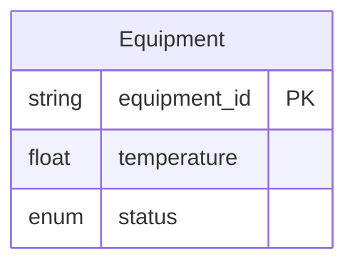

# Ontology Platform 进化设计方案

## 概述

将 ontology-builder 从一个 Palantir 本体生成 Skill 进化为通用本体管理平台，通过数据飞轮策略构建竞争壁垒。

**战略定位**：Palantir 优先，逐步通用化
**核心策略**：免费 Skill 获客 → 匿名数据积累壁垒 → 智能建议变现 → 平台功能锁客
**资源约束**：个人项目，业余时间 — 每一步必须独立可交付
**语言约定**：中文描述业务概念，英文描述技术术语
**起始时间**：2026年4月

---

## 进化路线图

```
Phase 0 (2周)   Phase 1a (月1-3)  Phase 1b (月3-5)  Phase 2 (月5-7)
┌────────────┐  ┌──────────────┐  ┌──────────────┐  ┌──────────────┐
│  稳定化     │─→│ 行业模板     │─→│ 关联建模     │─→│ 数据收集     │
│  修复P0/P1  │  │ + 可视化     │  │ + 配置导入   │  │ + 匿名上报   │
│  技术债清理 │  │ 2-3个新模板  │  │ links支持    │  │ 社区知识库   │
└────────────┘  └──────────────┘  └──────────────┘  └──────────────┘

                 Phase 3 (月7-9)               Phase 4 (月9+)
                 ┌──────────────┐             ┌──────────────┐
            ────→│ 智能建议引擎  │────────────→│  影响分析     │
                 │ Layer 1+2    │             │  (唯一功能)   │
                 │ 规则+个人统计 │             │  git版本管理  │
                 └──────────────┘             └──────────────┘
```

**关键决策点**：每个 Phase 结束时评估是否继续。Phase 1a 完成后如果无法获得 5 个以上有机用户，暂停后续 Phase，改为用户访谈找原因。

---

## Phase 0：稳定化（2周）

### 目标

修复 CLAUDE.md 中记录的 P0/P1 未解决问题，清理技术债，在坚实基础上开始新功能。

### 待修复项

| 优先级 | 问题 | 来源 |
|--------|------|------|
| P0 | TDD 验证未完成 — 没有测试就部署了 skill | CLAUDE.md 验证历史 |
| P0 | YAML frontmatter 格式错误 | CLAUDE.md 验证历史 |
| P1 | Description 字段违反 CSO 原则 | CLAUDE.md 验证历史 |
| P1 | SKILL.md 进一步精简（目标250-300行） | CLAUDE.md 验证历史 |

### 交付物

- [ ] 修复所有 P0 问题
- [ ] 修复所有 P1 问题
- [ ] 运行 TDD RED-GREEN-REFACTOR 测试周期
- [ ] 更新 CLAUDE.md 记录修复结果

---

## Phase 1a：行业模板 + 可视化（月1-3）

### 目标

用高质量行业模板和可视化输出吸引第一批用户。这是整个飞轮的初始动力。

### 1a.1 行业模板库

**新增 2-3 个模板**（根据实际完成情况决定数量，先完成再承诺）：

| 优先级 | 模板 | 行业 | 选择理由 |
|--------|------|------|---------|
| P0 | 供应商管理 | 供应链/采购 | Palantir 核心用例，用户群最大 |
| P1 | 客户工单管理 | 客服/运维 | 复杂度低，适合快速完成 |
| P2 | 销售机会管理 | CRM/销售 | 需求大，但与 Palantir 重叠度最低 |

**模板结构标准**（复用 equipment-monitoring-example.md 结构）：
- 业务背景与痛点
- 完整四要素定义（Property/Function/Action/Automation）
- 典型使用场景
- 部署后的业务价值
- 完整流程示意图

**交付原则**：先完成再承诺（Gotcha #1）。每个模板完成并验证后才更新 SKILL.md。

### 1a.2 可视化输出（Mermaid）

在 ontology-documentation.md 中增加 Mermaid ER 图：



**实现成本**：低 — 在输出阶段基于已收集的 Property 信息自动生成 Mermaid 代码块。

### 1a.3 Layer 1 规则建议（从 Phase 3 前移）

在现有质量检查基础上增加建议性规则：

```
规则: IF has_property(type=float) AND NOT has_function(pattern=risk_assessment)
建议: "你定义了数值型字段但没有风险判断规则。
      考虑添加：当[字段]超过阈值时，自动标记为高风险。"
```

这不需要任何数据积累，纯规则驱动。让用户提前感受到"智能建议"的价值。

### Phase 1a 交付物

- [ ] 至少 1 个新行业模板（供应商管理）
- [ ] 输出阶段增加 Mermaid ER 图生成
- [ ] Layer 1 规则建议（3-5 条规则）
- [ ] 更新 README.md 和 CLAUDE.md

### Phase 1a 决策门禁

完成后评估：
- 是否有 5+ 个有机用户使用过 skill？
- 用户反馈是什么？最常抱怨的是什么？
- **如果用户不足 → 暂停后续 Phase，做用户访谈**
- **如果用户反馈"需要关联建模" → 进入 Phase 1b**
- **如果用户反馈"需要更多模板" → 继续 Phase 1a（加模板）**

---

## Phase 1b：关联建模 + 配置导入（月3-5）

### 前置条件

Phase 1a 完成 + 决策门禁通过（有真实用户 + 用户需要此功能）。

### 1b.1 多对象关联建模

在阶段一增加关联对象引导：

```
引导话术：
"你的【设备】和其他业务对象有关联吗？比如：
 - 设备属于某条产线？（多对一）
 - 设备有多个维保工单？（一对多）
 - 设备由某个供应商提供？（多对一）"
```

YAML 配置增加 `links` 部分：

```yaml
links:
  - name: maintenance_orders
    targetObjectType: MaintenanceOrder
    cardinality: ONE_TO_MANY
    foreignKeyProperty: equipment_id
    description: "设备的维保工单记录"
```

新增参考指南 `references/link-guide.md`。

**范围限制**：只支持声明关联关系，不支持跨对象联合建模。

### 1b.2 已有配置导入

- 用户提供现有 YAML 配置文件
- Skill 解析配置结构，反向生成业务文档
- 执行质量检查，识别缺失的最佳实践
- 提供优化建议

### Phase 1b 交付物

- [ ] SKILL.md 增加关联对象引导
- [ ] `references/link-guide.md` 新增
- [ ] YAML 模板增加 links 部分
- [ ] 已有配置导入功能
- [ ] Mermaid 图支持关联关系展示

---

## Phase 2：数据收集层（月5-7）

### 前置条件

Phase 1 完成 + 有稳定的用户群（≥10 个用户使用过）。

### 2.1 核心概念：Schema Digest（模式摘要）

**设计原则**：不存原始配置，只存结构特征。

**Digest 结构**：

```yaml
digest_version: "1.0"
created_at: "2026-06-15T10:30:00Z"
digest_id: "sha256-of-structure"

# 行业分类（粗粒度，防止小群体去匿名化）
industry: "manufacturing"
# 注意：不存储 sub_domain，防止小群体指纹识别

# 对象结构统计（使用范围而非精确值）
object_count: 1
property_count_range: "10-15"   # 范围而非精确值
timeseries_ratio_range: "20-30%" # 范围而非精确值

# 模式分布（只存类别，不存数量）
has_function_patterns:
  - risk_assessment
  - status_inference
has_automation_patterns:
  - alert_response
  - scheduled_task

# 质量检查结果
quality_score: 78
p0_passed: true
p1_warning_count: 2
```

**隐私威胁模型**：
- 粗粒度行业分类（不存储 sub_domain）
- 数量使用范围而非精确值（"10-15个Property" 而非 "12个"）
- 在用户群体 < 20 的行业中，不提供行业对比统计
- 用户可随时删除所有本地 Digest

### 2.2 两层存储架构

```
用户完成本体构建
        │
        ▼
┌─────────────────────────┐
│  LLM 内联生成 Digest     │  ← 不需要外部脚本，LLM直接生成YAML
│  (SKILL.md 输出阶段指令)  │
└───────────┬─────────────┘
            │
     ┌──────┴──────┐
     ▼              ▼
┌──────────┐  ┌──────────────────────┐
│ 本地存储  │  │ 社区知识库（可选上报）  │
│ 项目目录/ │  │ GitHub Repo of Digests │
│ .digests/ │  │ (PR-based 贡献)        │
└──────────┘  └──────────────────────┘
```

**关键设计变更**（基于审查反馈）：

1. **不使用外部 Python 脚本**。Digest 由 LLM 在对话中直接生成并写入文件。Skill 是纯 Markdown，不引入可执行依赖。
2. **社区知识库 = GitHub 公开仓库**。用户可选择通过 PR 贡献匿名 Digest 到一个公开的 GitHub 仓库。零运维成本，完全透明。
3. **本地存储在项目目录**，不使用 `~/.ontology-data/`。跟着项目走，用 git 管理。

### 2.3 价值定位（诚实版）

**本地数据的价值**：改善你自己的下一次建模。
- "你上次的设备监控本体有12个Property，这次只定义了3个，要不要回顾上次的设计？"
- "你的历史配置中，75%都定义了限流保护，这次建议也加上"

**社区数据的价值**：行业基准对比（需要足够的贡献者）。
- 只有当某行业的 Digest 数量 ≥ 20 时才提供行业对比
- 数量不足时诚实告知："该行业数据不足，暂无法提供对比"

**不承诺做不到的事**：不声称"基于87个配置"（除非真有87个）。

### Phase 2 交付物

- [ ] Schema Digest 数据模型定义（粗粒度版）
- [ ] SKILL.md 输出阶段增加 Digest 生成指令
- [ ] 社区知识库 GitHub 仓库搭建
- [ ] 贡献流程文档（如何 PR 提交 Digest）
- [ ] 隐私威胁模型文档

---

## Phase 3：智能建议引擎（月7-9）

### 前置条件

Phase 2 完成 + 社区知识库有 ≥ 20 个 Digest。

### 3.1 两层智能（务实版）

```
Layer 2: 统计建议（需要社区数据）
  ├── 基于社区 Digest 的行业统计
  ├── "同行业X%的本体定义了..."
  └── 只在数据充足的行业提供

Layer 1: 规则建议（Phase 1a 已实现）
  ├── 纯规则驱动，不需要数据
  └── "你有数值字段但没有风险判断..."
```

**注意**：原设计的 Layer 3（行业知识图谱，需要 50+ Digest + 人工标注）标记为**远期愿景**，不纳入当前 Spec 范围。个人项目不具备人工标注 50+ Digest 的能力。

### 3.2 建议集成方式

建议直接嵌入 SKILL.md 的各阶段引导中，不需要外部引擎：

```markdown
# 在阶段二引导中
如果社区知识库中该行业的 Digest ≥ 20：
  "基于社区数据，该行业最常见的数据字段类型分布为：
   字符串 30%、数字 25%、枚举 20%、时间戳 15%、布尔 10%
   你的配置目前偏重 [具体类型]，要调整吗？"

否则：
  使用 Layer 1 规则建议（不引用不存在的统计数据）
```

### Phase 3 交付物

- [ ] 社区 Digest 统计分析脚本（生成行业摘要 JSON）
- [ ] SKILL.md 各阶段增加条件性统计建议
- [ ] 建议质量反馈机制（"这个建议有用吗？"）

---

## Phase 4：影响分析（月9+）

### 前置条件

Phase 3 完成 + 用户反馈需要本体变更管理能力。

### 4.1 影响分析（唯一核心功能）

构建四要素之间的依赖图：

```
Property: temperature
  ├── 被 Function risk_level 引用
  ├── 被 Automation high_temp_alert 的触发条件引用
  └── 被 Action update_temperature 修改

修改 temperature 的类型 →
  影响: risk_level (阈值判断), high_temp_alert (触发条件)
  安全: update_temperature (无类型依赖)
```

**输出**：

```
⚠️ 影响分析：修改 temperature (float → integer)

直接影响 (2):
  - Function risk_level: 阈值判断 temperature > 90.5 无法表达
  - Automation high_temp_alert: 触发条件引用了 temperature

无影响 (1):
  - Action update_temperature: 仅写入，无类型依赖

建议：保持 float 类型，或同时更新相关 Function 和 Automation 的阈值
```

**技术壁垒**：需要深度理解四要素之间的语义关系，竞争对手无法通过简单文本搜索复制。

### 4.2 版本管理（用 git，不重新发明）

不构建自定义版本管理系统。生成的 YAML 文件本身就是文本，直接用 git 管理：

- 用户的本体配置放在 git 仓库中
- `git diff` 天然支持 YAML 变更对比
- `git log` 提供完整历史
- Skill 可以在输出时生成有意义的 commit message

**唯一增强**：Skill 辅助生成语义化的 diff 说明（"本次变更：增加了3个Property，修改了1个Automation的触发条件"），而不是让用户看原始 YAML diff。

### Phase 4 交付物

- [ ] 依赖图构建逻辑（Property → Function → Action → Automation 引用关系）
- [ ] 影响分析引擎（输入：变更内容，输出：受影响的要素列表 + 建议）
- [ ] 语义化 diff 说明生成

---

## 商业化路径

### 变现假设（待验证，非已决定的架构）

Skill 是 Markdown 文本文件，没有原生的付费门控机制。商业化需要解决分发和门控问题。

**可能的变现模式**（按可行性排序）：

| 模式 | 可行性 | 说明 |
|------|--------|------|
| 咨询服务 | 高 | 基于 Skill 专长提供本体建模咨询 |
| 付费模板 | 中 | 高级行业模板单独售卖 |
| SaaS 化 | 低 | 需要构建 Web 应用，超出当前资源 |
| 订阅制 | 低 | Skill 文件无 DRM，难以执行 |

**验证实验**（Phase 1a 完成后执行）：
- 联系 10 个 Palantir 用户，提供免费试用
- 问："如果有更多行业模板和智能建议，你愿意付多少钱？"
- 根据反馈决定是否以及如何变现

**定价决策延迟到有真实用户反馈后。**

### GTM 策略

**具体分发渠道**：

| 渠道 | 方式 | 成本 |
|------|------|------|
| GitHub 开源 | 发布基础版，README 展示能力 | 零 |
| 技术博客 | 2-3 篇 "Palantir 本体建模最佳实践" | 业余时间 |
| Palantir 用户社区 | 通过已有 Palantir 客户关系分享 | 需要有关系 |
| Claude Code 生态 | 作为 Claude Code Skill 发布 | 待平台开放 |

**用户获取目标**：Phase 1a 结束时 ≥ 5 个有机用户。

---

## 壁垒评估（诚实版）

| 壁垒类型 | Phase 1 | Phase 2 | Phase 3 | Phase 4 |
|---------|---------|---------|---------|---------|
| 数据壁垒 | 无 | 开始积累（依赖贡献率） | 可能显著（需≥20 Digest/行业） | 可能强 |
| 技术壁垒 | 低 | 低 | 低-中 | 中（影响分析） |
| 切换成本 | 零 | 低（个人历史） | 低-中 | 中（影响分析依赖） |
| 网络效应 | 无 | 无（本地存储无网络效应） | 弱（社区数据→更好建议） | 弱 |
| 品牌认知 | 无 | 开始建立 | 社区认可 | 可能成为标准 |

**诚实总结**：在 Phase 3 之前，项目没有显著壁垒。竞争优势主要来自"先做了"和"做得细"。真正的壁垒取决于：(1) 能否吸引足够用户贡献数据；(2) 影响分析的技术深度是否难以复制。

---

## 风险与缓解

| 风险 | 概率 | 影响 | 缓解措施 |
|------|------|------|---------|
| 早期用户不足 | 高 | 高 | Phase 1a 设决策门禁；用户 < 5 则暂停，做访谈 |
| Palantir 推出官方工具 | 中 | 高 | 聚焦 Palantir 不做的事（跨平台、影响分析） |
| 个人精力不足 | 高 | 中 | 每 Phase 独立可交付，可在任何阶段暂停 |
| 数据飞轮转不起来 | 高 | 高 | Phase 2 用 GitHub PR 模式降低贡献门槛；手动种子数据 |
| 社区 Digest 被滥用 | 低 | 中 | 粗粒度设计 + PR 审核 + 威胁模型文档 |
| 隐私担忧 | 低 | 高 | 范围值而非精确值；小群体行业不提供对比 |

### 终止标准

| 阶段 | 终止条件 | 后续动作 |
|------|---------|---------|
| Phase 1a | 完成后 2 个月内有机用户 < 5 | 暂停开发，做 5 个用户访谈找原因 |
| Phase 2 | 上线 3 个月后社区 Digest < 10 | 放弃数据飞轮路线，转为纯工具定位 |
| Phase 3 | 智能建议采纳率 < 20% | 重新评估建议质量，可能回退到纯 Layer 1 |

---

## 成功标准（可测量版）

| 阶段 | KPI | 目标值 | 如何测量 |
|------|-----|--------|---------|
| Phase 0 | P0/P1 问题修复率 | 100% | 检查 CLAUDE.md 验证列表 |
| Phase 1a | 新增行业模板数 | ≥ 2 | 文件计数 |
| Phase 1a | GitHub stars | ≥ 10 | GitHub API |
| Phase 1a | 已知用户数 | ≥ 5 | 手动统计（社区反馈、邮件） |
| Phase 2 | 社区 Digest 贡献数 | ≥ 20 | GitHub PR 计数 |
| Phase 3 | 建议采纳率 | ≥ 40% | 用户反馈（"这个建议有用吗？"点击率） |

---

## 附录：与现有架构的兼容性

当前 ontology-builder 的文件结构保持不变。各 Phase 新增内容：

```
ontology-builder/
├── SKILL.md                     # 扩展：Layer 1 建议 (Phase 1a)
│                                #        关联建模引导 (Phase 1b)
│                                #        Digest 生成指令 (Phase 2)
│                                #        条件性统计建议 (Phase 3)
├── references/
│   ├── [现有6个guide]
│   ├── link-guide.md            # 新增 Phase 1b：关联关系指南
│   └── validation-guide.md      # 已有
├── assets/
│   ├── ontology-template.yaml   # 扩展：links 部分 (Phase 1b)
│   └── documentation-template.md # 扩展：Mermaid 图 (Phase 1a)
├── examples/
│   ├── equipment-monitoring-example.md  # 已有
│   ├── supplier-management-example.md   # 新增 Phase 1a
│   └── [更多模板按需添加]
└── .digests/                    # 新增 Phase 2：本地 Digest 存储
    └── [yyyy-mm-dd-industry-hash.yaml]
```

**无外部脚本依赖**。所有逻辑通过 SKILL.md 指令驱动 LLM 完成。

---

## 远期愿景（不纳入当前实施范围）

以下为长期方向思考，不承诺时间线：

- **Layer 3 行业知识图谱**：需要 50+ Digest + 人工标注，当前资源不支持
- **多平台导出**：Snowflake / Databricks 适配器，需要各平台专业知识
- **团队协作**：多人编辑同一本体，需要 SaaS 基础设施
- **SaaS 产品化**：Web 应用 + 订阅制，需要全职投入

这些方向在项目获得 traction（稳定月活 ≥ 50）后再评估。
